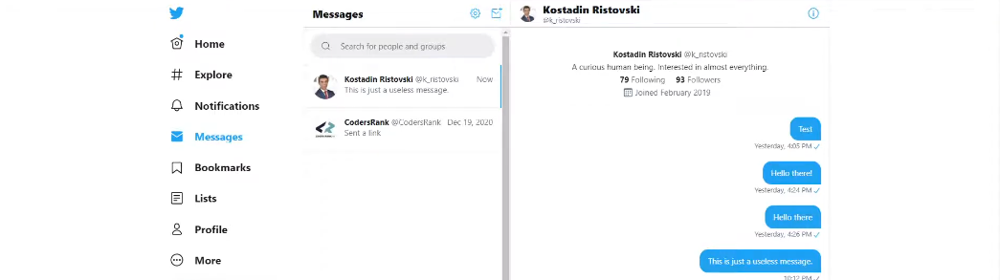

# ENVIANDO MENSAGENS COM TWEEPY
🚀PROJETO CRIADO NO CURSO DE TWEEPY.

 <br>

## DESCRIÇÃO:
Este bot desenvolvido em Python com a biblioteca Tweepy tem como principal funcionalidade enviar mensagens diretas automatizadas para usuários específicos no Twitter. Ele pode ser configurado para enviar mensagens diretas personalizadas para qualquer usuário do Twitter especificado pelo nome de usuário.

## FUNCIONAMENTO:
- O bot autentica-se no Twitter usando as credenciais fornecidas.
- Verifica a autenticação para garantir que as credenciais estejam corretas.
- Carrega o arquivo `MENSAGEM.json` para obter o nome de usuário do destinatário e o texto da mensagem.
- Envia a mensagem direta para o usuário especificado.
- Exibe mensagens de sucesso ou erros conforme necessário.

## EXECUTANDO O PROJETO:
1. **Autenticação como Desenvolvedor:**
   - Acesse o [Twitter Developer Portal](https://developer.twitter.com/) e inscreva-se para uma conta de desenvolvedor.
   - Crie um novo projeto e, dentro deste projeto, crie um novo aplicativo. O Twitter fornecerá as chaves e tokens de acesso necessários: API Key, API Key Secret, Bearer Token, Access Token, e Access Token Secret.
   - Edite o arquivo `./CODIGO/.env` com suas credenciais:
     ```plaintext
      API_KEY=Sua_API_Key
      API_KEY_SECRET=Sua_API_Key_Secret
      BEARER_TOKEN=Seu_Bearer_Token
      ACCESS_TOKEN=Seu_Access_Token
      ACCESS_TOKEN_SECRET=Seu_Access_Token_Secret
     ```

2. **Instalando as dependências:**
   - Antes de executar o bot, certifique-se de instalar todas as dependências necessárias. No terminal, execute o seguinte comando para instalar as dependências listadas no arquivo `requirements.txt` em `CODIGO`:
   ```bash
   pip install -r requirements.txt
   ```

3. **Editando o `MENSAGEM.json`:**
   - O arquivo `./CODIGO/MENSAGEM.json` deve ter a seguinte estrutura:

   ```json
   {
      "recipient_screen_name": "username_destinatario",
      "message_text": "Olá! Esta é uma mensagem direta enviada pelo meu bot."
   }
   ```

   - Ele precisa ter o nome de usuário do destinatário e o conteúdo da mensagem que deseja enviar.

4. **Inicie o Bot:**
   - Execute o bot iniciando-o com o seguinte comando:
    ```bash
    python CODIGO.py
    ```

## NÃO SABE?
- Entendemos que para manipular arquivos em muitas linguagens e tecnologias relacionadas, é necessário possuir conhecimento nessas áreas. Para auxiliar nesse aprendizado, oferecemos cursos gratuitos disponíveis:
* [CURSO DE PYTHON](https://github.com/VILHALVA/CURSO-DE-PYTHON)
* [CURSO DE JSON](https://github.com/VILHALVA/CURSO-DE-JSON)
* [CONFIRA MAIS CURSOS](https://github.com/VILHALVA?tab=repositories&q=+topic:CURSO)

## CREDITOS:
- [PROJETO CRIADO NO CURSO DE TWEEPY](https://github.com/VILHALVA/CURSO-DE-TWEEPY)
- [PROJETO FEITO PELO VILHALVA](https://github.com/VILHALVA)

